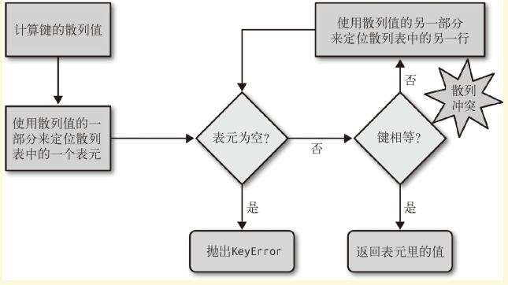

# Fluent Python

### Chapter 1  Python数据模型

特殊方法名能让你自己的对象实现和支持以下的语言构架， 并与之交互：

- 迭代
- 集合类
- 属性访问
- 运算符重载
- 函数和方法的调用
- 对象的创建和销毁
- 字符串表示形式和格式化
- 管理上下文（ 即 with 块）

特殊方法的存在是为了被 Python 解释器调用的， 你自己并不需要调用它们。通过内置的函数（ 例如 len、 iter、 str， 等等） 来使用特殊方法是最好的选择。 这些内置函数不仅会调用特殊方法， 通常还提供额外的好处， 而且对于内置的类来说， 它们的速度更快。

通过实现特殊方法， 自定义数据类型可以表现得跟内置类型一样， 从而让我们写出更具表达力的代码——或者说， 更具 Python 风格的代码。

len 之所以不是一个普通方法

1. 是为了让 Python 自带的数据结构可以走后门，速度更快。
2. 可以把 len 用于自定义数据类型。

bool(x) 的背后是调用`x.__bool__()` 的结果； 如果不存在`__bool__` 方法， 那么 bool(x) 会尝试调用 `x.__len__()`。 若返回 0， 则 bool 会返回 False； 否则返回True。

### Chapter 2  序列构成的数组

Python 从 ABC 那里继承了用统一的风格去处理序列数据这一特点。不管是哪种数据结构， 字符串、 列表、 字节序列、 数组、 XML元素，抑或是数据库查询结果， 它们都共用一套丰富的操作： 迭代、 切片、 排序， 还有拼接。

#### 内置序列

- 存放类型
  - 容器序列

    list、 tuple 和 collections.deque 这些序列能存放不同类型的数据

  -  扁平序列

     str、 bytes、 bytearray、 memoryview 和 array.array， 这类序列只能容纳一种类型。

> 容器序列存放的是它们所包含的任意类型的对象的引用， 而扁平序列里存放的是值而不是引用。 换句话说， 扁平序列其实是一段连续的内存空间。 扁平序列体积更小、 速度更快而且用起来更简单， 但是它只能保存一些原子性的数据，比如数字、 字符和字节。 容器序列则比较灵活， 但是当容器序列遇到可变对象时，容易产生意外情况，需确保代码正确。

- 能否被修改

  - 可变序列

  list、 bytearray、 array.array、 collections.deque 和memoryview

  - 不可变序列

  tuple、 str 和 bytes

#### 列表推导（ list comprehension） 

列表推导可以帮助我们把一个序列或是其他可迭代类型中的元素过滤或是加工， 然后再新建一个列表。

Python3表达式内部的变量和赋值只在局部起作用， 表达式的上下文里的同名变量还可以被正常引用， 局部变量并不会影响到它们。

```python
>>> x = 'ABC'
>>> dummy = [ord(x) for x in x]
>>> x 
'ABC'
>>> dummy 
[65, 66, 67]
```

列表推导中两个 for 循环时，两者的关系为嵌套关系，执行关系为先内层后外层

```python
>>> colors = ['black', 'white']
>>> sizes = ['S', 'M', 'L']

>>> tshirts = [(color, size) for color in colors for size in sizes] 
>>> tshirts
[('black', 'S'), ('black', 'M'), ('black', 'L'), ('white', 'S'),
('white', 'M'), ('white', 'L')]

>>> tshirts = [(color, size) for size in sizes for color in colors]
>>> tshirts
[('black', 'S'), ('white', 'S'), ('black', 'M'), ('white', 'M'),
('black', 'L'), ('white', 'L')]
```

列表推导的作用只有一个： 生成列表。

#### 生成器表达式（ generator expression）

如果想生成其他类型的序列， 生成器表达式就派上了用场。

**虽然也可以用列表推导来初始化元组、 数组或其他序列类型， 但是生成器表达式是更好的选择。 这是因为生成器表达式背后遵守了迭代器协议， 可以逐个地产出元素， 而不是先建立一个完整的列表， 然后再把这个列表传递到某个构造函数里。 可以节省内存。**

使用生成器逐个产出元素

```python
>>> colors = ['black', 'white']
>>> sizes = ['S', 'M', 'L']
>>> for tshirt in ('%s %s' % (c, s) for c in colors for s in sizes): 
... print(tshirt)
...
black S
black M
black L
white S
white M
white L
```

#### 元组（tuple）

1. **没有字段名的记录**

元组其实是对数据的记录，元组中的每个元素都存放了记录中一个字段的数据， 外加这个字段的位置。 正是这个位置信息给数据赋予了意义。

**元组拆包**

for 循环可以分别提取元组里的元素， 也叫作拆包（ unpacking）

```python
# 平行赋值
>>> lax_coordinates = (33.9425, -118.408056)
>>> latitude, longitude = lax_coordinates 

# 不使用中间变量交换两个变量的值
>>> b, a = a, b

# 用 * 运算符把可迭代对象拆开作为函数的参数
>>> t = (20, 8)
>>> divmod(*t)
>>> quotient, remainder = divmod(*t)

# 让一个函数可以用元组的形式返回多个值
>>> _, filename = os.path.split('/home/luciano/.ssh/idrsa.pub')
```

> _ 占位符可表示我们不感兴趣的数据
>
> \* 也可以忽略我们不感兴趣的数据

接受表达式的元组可以是嵌套式的， 例如 (a, b, (c, d))。 只要这个接受元组的嵌套结构符合表达式本身的嵌套结构， Python 就可以作出正确的对应。

```python
>>> grades = [('LiMing', 'male', ('grade', 'A')),
...           ('LiuYang', 'female', ('grade', 'B')),
...           ('ZhangNing', 'male', ('grade', 'c'))]
>>> for name, gender, (grade, Alpha) in grades:
...     print('%s:%s' % (name, gender))
...     print('%s:%s' % (grade, Alpha))
... 
LiMing:male
grade:A
LiuYang:female
grade:B
ZhangNing:male
grade:c
```

2. **不可变列表**

除了跟增减元素相关的方法之外， 元组支持列表的其他所有方法。

#### 具名元组（namedtuple）

collections.namedtuple 是一个工厂函数， 它可以用来构建一个带字段名的元组和一个有名字的类——这个带名字的类对调试程序有很大帮助。

创建一个具名元组需要**两个参数**， 一个是类名， 另一个是类的各个字段的名字。 后者可以是由数个字符串组成的可迭代对象， 或者是由空格分隔开的字段名组成的字符串。

```python
>>> from collections import namedtuple

# 由数个字符串组成的可迭代对象
>>> City = namedtuple('City', 'name country population coordinates') 
# 由空格分隔开的字段名组成的字符串
>>> City = namedtuple('City', ['name', 'country', 'population', 'coordinates'])
>>> tokyo = City('Tokyo', 'JP', 36.933, (35.689722, 139.691667)) 
>>> tokyo
City(name='Tokyo', country='JP', population=36.933, coordinates=(35.689722,
139.691667))
```

除了从普通元组那里继承来的属性之外， 具名元组还有一些自己专有的属性。

```python
>>> from collections import namedtuple
>>> City = namedtuple('City', 'name country population coordinates')

# _fields 返回一个包含这个类所有字段名称的元组
>>> City._fields
('name', 'country', 'population', 'coordinates')
>>> delhi_data = ('Delhi NCR', 'IN', 21.935, (28.613889, 77.208889))

# _make() 接收一个可迭代对象生成类的实例 
>>> delhi = City._make(delhi_data)
>>> delhi
City(name='Delhi NCR', country='IN', population=21.935, coordinates=(28.613889, 77.208889))

# _asdict() 以collections.OrderedDict 的形式返回
>>> delhi._asdict()
OrderedDict([('name', 'Delhi NCR'), ('country', 'IN'), ('population', 21.935), ('coordinates', (28.613889, 77.208889))])
```

#### 切片

可以用 s[a：b：c] 的形式对 s 在 a 和 b之间以 c 为间隔取值。 c 的值还可以为负， 负值意味着反向取值。

s1 = s[::-1]可对序列取反

如果把切片放在赋值语句的左边， 或把它作为 del 操作的对象， 我们就可以对序列进行嫁接、 切除或就地修改操作。

```python
>>> l = list(range(10))
>>> l
[0, 1, 2, 3, 4, 5, 6, 7, 8, 9]
>>> l[2:5] = [20, 30]
>>> l
[0, 1, 20, 30, 5, 6, 7, 8, 9]
>>> del l[5:7]
>>> l
[0, 1, 20, 30, 5, 8, 9]
# 复制对象是切片时，右边必须为可迭代序列
>>> l[2:5] = [100]
```


**序列  +、\* 和增量赋值**

如果在 a * n 这个语句中， 序列 a 里的元素是对其他可变对象的引用的话，生成新序列的 n 个引用都指向同一个对象。修改原始对象内容 n 个引用同时改变。可用`[a for i in range(n)]`创建

增量赋值

- 可变序列：就地修改原对象的值，引用指向的内存地址不变
- 不可变序列：在背后生成新的序列（创建一个新的指向不同内存地址的同名引用）

 += 背后的特殊方法是 \_\_iadd\_\_ 。但是如果一个类没有实现这个方法的话， Python 会退一步调用 \_\_add\_\_。\*=同理 

#### 序列排序

list.sort 方法会就地排序列表，返回值是 None

如果一个函数或者方法对对象进行的是就地改动， 那它就应该返回 None， 好让调用者知道传入的参数发生了变动， 而且并未产生新的对象。

内置函数 sorted 会新建一个列表作为返回值。可以接受任何形式的可迭代对象作为参数， 甚至包括不可变序列或生成器。 而不管 sorted 接受的是怎样的参数， 它最后都会返回一个列表。

list.sort 方法和 sorted 函数， 都有两个可选的关键字参数：

- reverse：True or False
- key：一个只有一个参数的函数， 这个函数会被用在序列里的每一个元素上， 所产生的结果将是排序算法依赖的对比关键字。key=str.lower  key=len 

**用bisect来管理已排序的序列**

`import bisect`

bisect(haystack, needle) 把 needle 插入这个位置之后， haystack 还能保持升序

bisect_left(haystack, needle) 插到相同元素前面

bisect.bisect 的作用则是快速查找，可以用来建立一个用数字作为索引的查询表格

```python
>>> def grade(score, breakpoints=[60, 70, 80, 90], grades='FDCBA'):
... i = bisect.bisect(breakpoints, score)
... return grades[i]
...
>>> [grade(score) for score in [33, 99, 77, 70, 89, 90, 100]]
['F', 'A', 'C', 'C', 'B', 'A', 'A']
```

**用bisect.insort插入新元素**

bisect.insort(seq, item) 把变量 item 插入到序列 seq 中， 并能保持 seq的升序顺序

#### 数组

`from array import array`

如果需要一个只包含数字的列表， 那么 array.array 比 list 更高效

另外一个快速序列化数字类型的方法是使用[pickle](https://docs.python.org/3/library/pickle.html)模块。pickle.dump 可以处理几乎所有的内置数字类型， 包含复数、 嵌套集合， 甚至用户自定义的类。

array.tofile 和 array.fromfile 方法将列表存入文件或取出

数组排序需用 sorted 函数新建数组

`a = array.array(a.typecode, sorted(a))`

**NumPy 和 SciPy**处理大规模数值型数据

#### 双向队列和其他形式队列

`from collections import deque`

 双向队列是一个线程安全、 可以快速从两端添加或者删除元素的数据类型。便于存放“最近用到的几个元素”

### Chapter 3 字典和集合

dict 和 set “以空间换时间”

列表的背后没有散列表来支持 in 运算符， 每次搜索都需要扫描一次完整的列表， 导致所需的时间跟据 haystack 的大小呈线性增长

**字典中的散列表**

散列表其实是一个稀疏数组（ 总是有空白元素的数组称为稀疏数组） 。在一般的数据结构教材中， 散列表里的单元通常叫作表元（ bucket） 。在 dict 的散列表当中， 每个键值对都占用一个表元， 每个表元都有两个部分， 一个是对键的引用， 另一个是对值的引用。 因为所有表元的大小一致， 所以可以通过偏移量来读取某个表元。

Python 会设法保证大概还有三分之一的表元是空的， 所以在快要达到这个阈值的时候， 原有的散列表会被复制到一个更大的空间里面。

如果要把一个对象放入散列表， 那么首先要计算这个元素键的散列值。Python 中可以用 hash() 方法来做这件事情

1. 散列值和相等性

内置的 hash() 方法运行的是 \_\_hash\_\_

如果两个对象在比较的时候是相等的， 那它们的散列值必须相等， 否则散列表就不能正常运行了。

为了让散列值能够胜任散列表索引这一角色， 它们必须在索引空间中尽量分散开来。 这意味着在最理想的状况下， 越是相似但不相等的对象， 它们散列值的差别应该越大。 

2. 散列表算法



**dict的实现及其导致的结果**

1. 键必须是可散列的

一个可散列的对象必须满足以下要求:

- 支持 hash() 函数， 并且通过 \_\_hash\_\_() 方法所得到的散列值是不变的。
- 支持通过 \_\_eq\_\_() 方法来检测相等性。
- 若 a == b 为真， 则 hash(a) == hash(b) 也为真。

> Python 里所有的不可变类型都是可散列的(元组包含的所有元素都是可散列类型)
>
> 原子不可变数据类型（ str、 bytes 和数值类型）、 frozenset、tuple 

所有由用户自定义的对象默认都是可散列的， 因为它们的散列值由id() 来获取， 而且它们都是不相等的

2. 字典在内存上的开销巨大

由于字典使用了散列表， 而散列表又必须是稀疏的， 这导致它在空间上的效率低下。 

需要存放数量巨大的记录， 那么放在由元组或是具名元组构成的列表中会是比较好的选择

3. 键查询很快

dict 的实现是典型的空间换时间： 字典类型有着巨大的内存开销， 但它们提供了无视数据量大小的快速访问

4. 键的次序取决于添加顺序

当往 dict 里添加新键而又发生散列冲突的时候， 新键可能会被安排存放到另一个位置。 

5. 往字典里添加新键可能会改变已有键的顺序

无论何时往字典里添加新的键， Python 解释器都可能做出为字典扩容的决定。 

不要对字典同时进行迭代和修改,否则迭代很有可能会跳过一些键——甚至是跳过那些字典中已经有的键

**set的实现以及导致的结果**

1. 集合里的元素必须是可散列的
2. 集合很消耗内存
3. 可以很高效地判断元素是否存在于某个集合
4. 元素的次序取决于被添加到集合里的次序
5. 往集合里添加元素， 可能会改变集合里已有元素的次序

**字典推导（dictcomp）**

字典推导（ dictcomp） 可以从任何以键值对作为元素的可迭代对象中构建出字典。 

```python
>>> DIAL_CODES = [ 
... (86, 'China'),
... (91, 'India')
]
>>> country_code = {country.upper(): code for code, country in DIAL_CODES} 
```

**处理找不到的键**

```python
d.get(k,[default])

d.setdefault(key, [default])
```

**映射的弹性键查询**

就算某个键在映射里不存在， 我们也希望在通过这个键读取值的时候能得到一个默认值。

1. 通过 defaultdict 类型


`collections.defaultdict([default_factory[,...]])`

在实例化一个 defaultdict 的时候， 需要给构造方法提供一个可调用对象， 这个可调用对象会在 __getitem__ 碰到找不到的键的时候被调用， 让 \_\_getitem\_\_ 返回某种默认值。


2. 自定义一个 dict 子类并实现 \_\_missing\_\_ 方法


所有的映射类型在处理找不到的键的时候， 都会牵扯到 \_\_missing\_\_方法。\_\_missing\_\_ 方法只会被 \_\_getitem\_\_ 调用（ 比如在表达式 d[k] 中） 。 提供 \_\_missing\_\_方法对 get 或者\_\_contains\_\_（ in 运算符会用到这个方法）这些方法的使用没有影响。

**字典的变种**

- collections.OrderedDict

这个类型在添加键的时候会保持顺序， 因此键的迭代次序总是一致的。 OrderedDict 的 popitem 方法默认删除并返回的是字典里的最后一个元素， 但是如果像 my_odict.popitem(last=False) 这样调用它， 那么它删除并返回一个被添加进去的元素。

- collections.ChainMap

该类型可以容纳数个不同的映射对象， 然后在进行键查找操作的时候， 这些对象会被当作一个整体被逐个查找， 直到键被找到为止。

- collections.Counter

这个映射类型会给键准备一个整数计数器。 每次更新一个键的时候都会增加这个计数器。 所以这个类型可以用来给可散列表对象计数， 或者是当成多重集来用——多重集合就是集合里的元素可以出现不止一次。

most_common([n]) 会按照次序返回映射里最常见的 n 个键和它们的计数

```python
>>> ct = collections.Counter('abracadabra')
>>> ct
Counter({'a': 5, 'b': 2, 'r': 2, 'c': 1, 'd': 1})
>>> ct.update('aaaaazzz')
>>> ct
Counter({'a': 10, 'z': 3, 'b': 2, 'r': 2, 'c': 1, 'd': 1})
>>> ct.most_common(2)
[('a', 10), ('z', 3)]
```

- colllections.UserDict

更倾向于从 UserDict 而不是从 dict 继承的主要原因是， 后者有时会在某些方法的实现上走一些捷径， 导致我们不得不在它的子类中重写这些方法， 但是 UserDict 就不会带来这些问题

UserDict 并不是 dict 的子类， 但是UserDict 有一个叫作 data 的属性， 是 dict 的实例， 这个属性实际上是 UserDict 最终存储数据的地方。 

**不可变映射类型**

`from types import MappingProxyType`

MappingProxyType 接收一个 dict 返回一个只读的 dict 对象

**集合（set）**

1. 集合可以去重
2. 集合可以进行运算

> a | b 并集
>
> a & b 交集（统计两个集合重复元素个数）
>
> a - b 差集
>
> \>、<、=比较

集合中的元素必须是可散列的， set 类型本身是不可散列的， 但是frozenset 可以。 

```
s = set()
s = {*args}
```
**set 方法**
```python
s.add(e)
s.clear()
s.copy()
s.discard(e)
s.pop()
s.remove(e)
```

**dict 方法**

```python
d.clear()
d.copy()
del d[k]
d.get(key, [default])
d.setdefault(key, [default])
d.items()
d.keys()
d.values()
d.__missing__()
d.pop()
d.update(m,[**kargs])	# m 可以是映射或者键值对迭代器， 用来更新 d 里对应的条目
```

